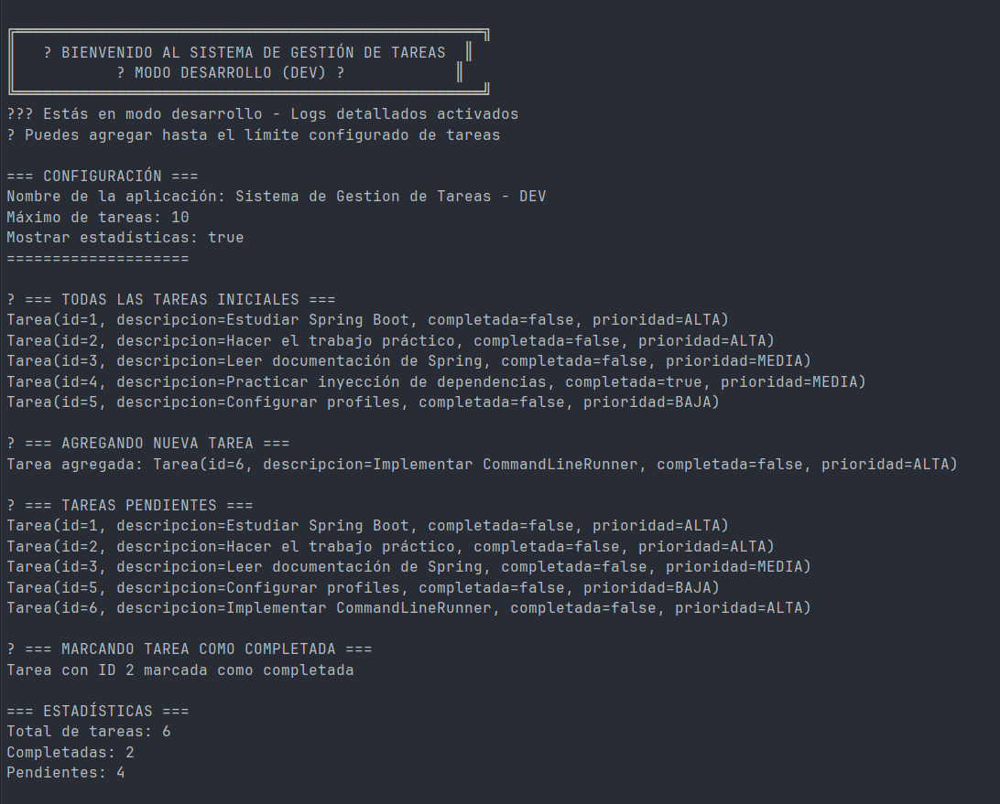
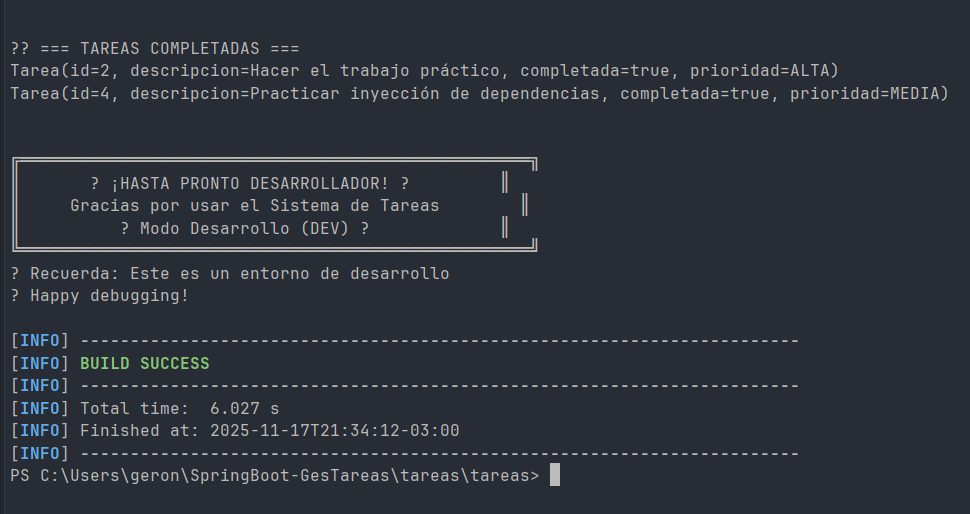
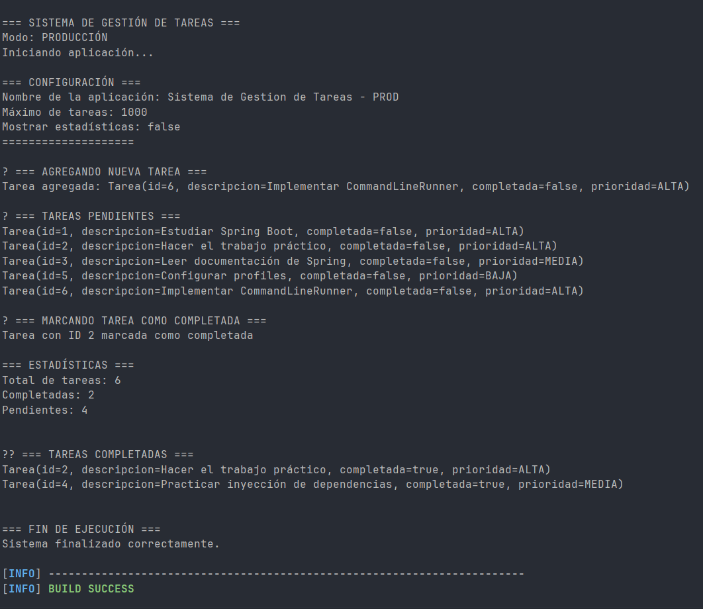

# 📋 Sistema de Gestión de Tareas

## 📝 Descripción del Proyecto

Sistema de gestión de tareas (To-Do List) desarrollado con Spring Boot que implementa los conceptos fundamentales del framework:
- **Inyección de Dependencias** por constructor
- **Estereotipos** (@Service, @Repository, @Component)
- **Configuración** mediante properties
- **Gestión de entornos** con profiles (dev/prod)
- **CommandLineRunner** para ejecutar lógica al inicio

Este proyecto fue desarrollado como trabajo práctico para la materia Programación III de la Tecnicatura Universitaria en Programación.

---

## ⚙️ Tecnologías Utilizadas

- **Java 17**
- **Spring Boot 3.2.0**
- **Maven** (gestor de dependencias)
- **Spring Boot DevTools** (recarga automática en desarrollo)
- **Lombok** (opcional - reduce código boilerplate)

---

## 🏗️ Arquitectura del Proyecto

```
com.utn.tareas
├── model/
│   ├── Prioridad.java (enum: ALTA, MEDIA, BAJA)
│   └── Tarea.java (entidad principal)
├── repository/
│   └── TareaRepository.java (@Repository - almacenamiento en memoria)
├── service/
│   ├── TareaService.java (@Service - lógica de negocio)
│   ├── MensajeService.java (interfaz)
│   ├── MensajeDevService.java (@Profile("dev"))
│   └── MensajeProdService.java (@Profile("prod"))
└── TareasApplication.java (clase principal con CommandLineRunner)
```

---

## 🚀 Instrucciones para Clonar y Ejecutar

### 1️⃣ Clonar el Repositorio

```bash
git clone https://github.com/GuevaraMansuino/GestorTareas
```

### 2️⃣ Compilar el Proyecto

```bash
mvn clean install
```

### 3️⃣ Ejecutar la Aplicación

```bash
mvn spring-boot:run
```

O desde tu IDE favorito (IntelliJ IDEA, Eclipse, VS Code):
- Ejecuta la clase `TareasApplication.java`

---

## 🔧 Cómo Cambiar entre Profiles (dev/prod)

### Opción 1: Modificar `application.properties`

Abre el archivo `src/main/resources/application.properties` y cambia:

```properties
# Para desarrollo
spring.profiles.active=dev

# Para producción
spring.profiles.active=prod
```

### Opción 2: Parámetro en la línea de comandos

```bash
# Ejecutar en modo desarrollo
mvn spring-boot:run -Dspring-boot.run.profiles=dev

# Ejecutar en modo producción
mvn spring-boot:run -Dspring-boot.run.profiles=prod
```

### Opción 3: Variable de entorno

```bash
export SPRING_PROFILES_ACTIVE=prod
mvn spring-boot:run
```

---

## 📸 Capturas de Pantalla
### Para Desarrollo



### Para Produccion


### Ejecución con Profile DEV
```
╔═══════════════════════════════════════════════════╗
║   🚀 BIENVENIDO AL SISTEMA DE GESTIÓN DE TAREAS  ║
║           🔧 MODO DESARROLLO (DEV) 🔧            ║
╚═══════════════════════════════════════════════════╝
👨‍💻 Estás en modo desarrollo - Logs detallados activados
📝 Puedes agregar hasta el límite configurado de tareas

=== CONFIGURACIÓN ===
Nombre de la aplicación: Sistema de Gestión de Tareas - DEV
Máximo de tareas: 10
Mostrar estadísticas: true
====================
```

### Ejecución con Profile PROD
```
=== SISTEMA DE GESTIÓN DE TAREAS ===
Modo: PRODUCCIÓN
Iniciando aplicación...

=== CONFIGURACIÓN ===
Nombre de la aplicación: Sistema de Gestión de Tareas - PROD
Máximo de tareas: 1000
Mostrar estadísticas: false
====================
```

---

## 🎯 Funcionalidades Implementadas

✅ Crear y gestionar tareas con prioridades (ALTA, MEDIA, BAJA)  
✅ Listar todas las tareas  
✅ Filtrar tareas pendientes y completadas  
✅ Marcar tareas como completadas  
✅ Obtener estadísticas (total, completadas, pendientes)  
✅ Validación de límite máximo de tareas según configuración  
✅ Mensajes personalizados según el entorno (dev/prod)  
✅ Configuración dinámica mediante properties  
✅ Beans condicionales con @Profile

---

## 🧪 Configuración por Entorno

### Development (dev)
- Máximo de tareas: **10**
- Logs: **DEBUG**
- Mensajes: **Detallados y amigables**
- Estadísticas: **Habilitadas**

### Production (prod)
- Máximo de tareas: **1000**
- Logs: **ERROR**
- Mensajes: **Simples y concisos**
- Estadísticas: **Deshabilitadas**

---

## 💭 Conclusiones Personales

A través de este trabajo práctico he logrado:

1. **Comprender la Inyección de Dependencias**: Aplicar el principio de Inversión de Control (IoC) mediante inyección por constructor, lo que hace el código más testeable y mantenible.

2. **Dominar los Estereotipos de Spring**: Utilizar correctamente @Service, @Repository y @Component según la responsabilidad de cada clase en la arquitectura.

3. **Gestionar Configuraciones**: Implementar configuración externalizada con properties y la anotación @Value para hacer la aplicación más flexible.

4. **Trabajar con Profiles**: Crear diferentes configuraciones para entornos de desarrollo y producción, una práctica esencial en proyectos profesionales.

5. **Implementar Beans Condicionales**: Usar @Profile para crear beans específicos por entorno, demostrando el poder de Spring para adaptarse a diferentes contextos.

6. **Aplicar Buenas Prácticas**: Estructura de paquetes profesional, inyección por constructor, uso de Optional, y separación de responsabilidades.

Este proyecto me ha dado una base sólida para trabajar con Spring Boot y entender cómo se estructuran aplicaciones empresariales modernas.

---

## 👤 Autor

**Nombre**: [Geronimo Guevara Mansuino]  
**Legajo**: [52661]  
**Materia**: Programación III  
**Institución**: Tecnicatura Universitaria en Programación - UTN

---

## 📄 Licencia

Este proyecto fue desarrollado con fines educativos para la UTN.

---
